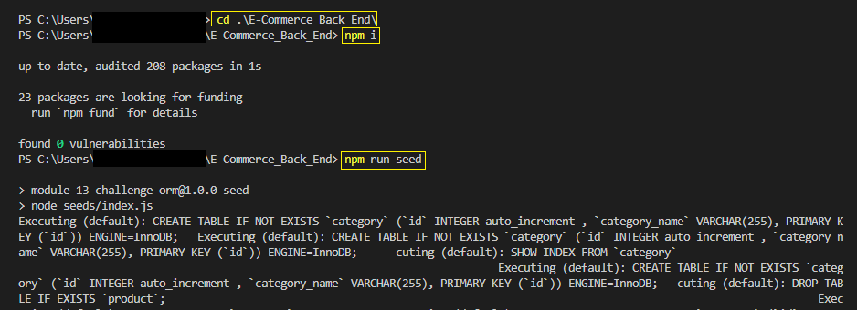
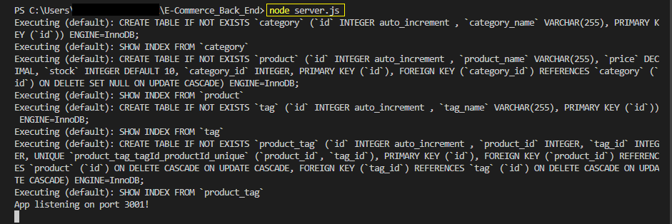

# E-Commerce Back End

## Description

Build the back-end for an e-commerce site

- Use node.js as a platform
- Use express.js and Sequelize to interact with a MySQL database
- Use 'dotevn' to hide private information from public place

## Table of Contents

1. [Installation](#installation)
2. [Usage](#usage)
3. [License](#license)
4. [Contributing](#contributing)
5. [Test](#test)
6. [Questions](#questions)

## Installation

1. Move to the directory where server.js is
2. npm i
3. npm run seed
4. node server.js

Please refer to the image below.

## Usage

1. When I open API GET routes in Insomnia for categories, products, or tags, then the data for each of these routes is displayed in a formatted JSON
2. When I test API POST, PUT, and DELETE routes in Insomnia, then I am able to successfully create, update, and delete data in my database

`Please refer to the walkthrough video: `
https://watch.screencastify.com/v/c3Rl7wGYVl9GMivW9qNV

## License

Copyright (c) 2022 `wonjong2` (GitHub Username) Licensed under [the MIT License](https://choosealicense.com/licenses/mit/).

## Contributing

All your inputs are valuable and I love them.

- Reporting a bug
- Submiiting a fix
- Proposing new features

## Test

N/A

## Questions

1. GitHub: https://github.com/wonjong2
2. If you have any questions, please reach out to wonjong2@gmail.com
